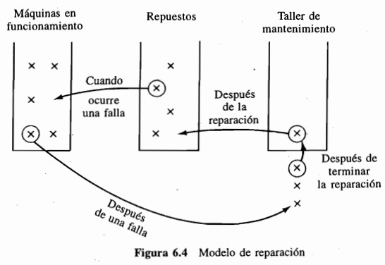
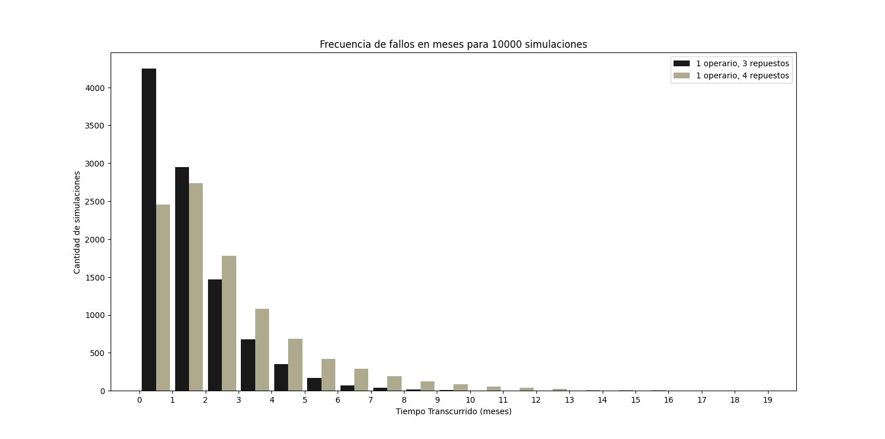
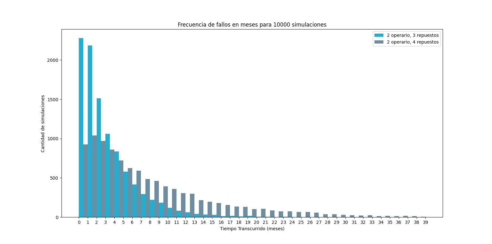
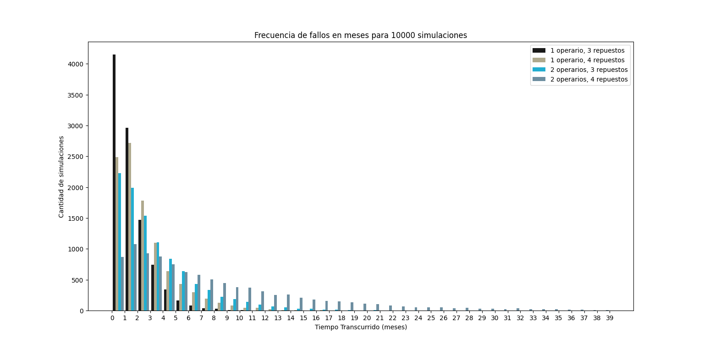

# Reporte

## Introducción

### Presentación del problema

Un supermercado necesita que N cajas registradoras estén funcionando al mismo tiempo. Para evitar tener que cerrar, se tienen máquinas en un depósito como repuestos por si alguna se descompone. Cada vez que una de las cajas registradoras que se encontraba en uso se descompone, inmediatamente se reemplaza por un repuesto y se envía a un taller donde será reparada. Una máquina recién reparada queda disponible como repuesto en el depósito como si nunca hubiese estado rota, por lo que se podrá utilizar de ser necesario.

Todos los tiempos de reparación son variables aleatorias independientes con una funcion de distrubución común \*exponencial de parámetro **lambda_R\***.
Cada vez que una máquina comienza a trabajar, el tiempo que funciona hasta descomponerse es una variable aleatoria, independiente de las anteriores, con función de distribución \*exponencial de parámetro **lambda_F\***.

El supermercado cerrará cuando una máquina se descomponga y no hayan repuestos. Si al principio hay _N_ + _S_ máquinas en buen estado, de las cuales _N_ se ponen a trabajar y _S_ quedan como repuestos, estamos interesados en simular el sistema para aproximar E[T], donde T es el tiempo en que falla.

El problema anteriormente descripto, se resolverá primero para un operario trabajando en solitario y luego, por separado, para dos que trabajan paralelamente entre sí.

### Procedimiento de solución

La solución al problema con un solo operario consiste en registrar los tiempos de falla iniciales de las máquinas y guardarlos. Al descomponerse la primera será reemplazada por una en depósito inmediatamente y se enviará al técnico (como es la primera no habrán más siendo reparadas y comenzará a ser reparada)
Al llegar a la segunda descompostura, será reemplazada por una en depósito inmediatamente y se enviará al técnico; Si la reparación de la primera caja registradora finalizó y fue enviada nuevamente al depósito la reparación de la segunda comenzará, caso contrario será puesta en lista de espera.
Ese proceso continuará hasta que una máquina se descomponga y no hayan repuestos porque estén todos en lista de espera.

La única diferencia entre uno y dos operarios será que podrán ser reparadas al mismo tiempo dos cajas registradoras en caso de ser necesario.

---

## Algoritmo y descripción de las Variables

### Declacración de variables y parámetros

Para simular lo anterior, utilizamos las siguientes variables:

1. Variable de tiempo **t**
2. Variable de estado **r** (número de máquinas descompuestas en el instante t)
3. Variable de estado **X** (lista ordenada de los tiempos de falla para las máquinas activas)
4. Variable de tiempo **t_rep** (momento en que será reparada la máquina actual por el operario correspondiente)
5. Parámetro **lambda_F**, que define la tasa de fallas para la distribución exponencial
6. Parámetro **lambda_R**, que define la tasa de reparaciones para la distribución exponencial
7. Parámetro **N** (número de máquinas necesarias para el funcionamiento del supermercado)
8. Parámetro **s** (número de máquinas disponibles en depósito)

### Descripción del algoritmo

Como la r cambiará cuando una máquina en buen estado se descompone o cuando termina de ser reparada, decimos que ocurre un _evento_ si ocurre cualquiera de estas dos situaciónes.
Para saber cuándo ocurrirá el siguiente evento, necesitamos llevar un registro de los instantes en los cuales fallan las máquinas que están en uso y el instante en que la máquina en reparación (si hay alguna) concluye su proceso (podemos generarlos de antemano ya que dependen de una distribución conocida).
Puesto que siempre debemos determinar el mínimo de los _N_ tiempos de descompostura, conviene anotar estos valores en una lista ordenada.

#### Incialización

Generar _N_ variables aleatorias independientes con distribución exponencial de parámetro **lambda_F** y almacenarlas en las posiciones 0 a n-1 de la variable de estado **X**; Una vez generadas, ordenar los elementos de la lista X de manera decreciente.

Valuar **t** y **r** en 0, **t_rep** debe inicializarse como el valor mas alto posible (inf)

#### Lazo infinito

Una vez inicializadas las variables, debemos realizar una serie de pasos hasta que se cumpla la condición de que se descompone una caja registradora y no quedó ninguna en depósito (momento en el cual finaliza la simulacion y se devuelve el resultado final). Los pasos se dividirán en dos casos:

**Caso 1:** Una caja registradora se descompone:

Ahora estaremos situados en el momento en que se descompone una caja registradora, por lo cuál debemos valuar **t** en **_X[0]_**, ya que la lista es ordenada y el primer elemento será quien se rompa antes (**t = _X[0]_**).

Como falló una caja registradora, debo aumentar el contador correspondiente en 1 (**r += r**).

Aquí debo revisar si es momento de finalizar la simulacion: Si el valor de **r** es igual al de **s** + 1 quiere decir que no hay más repuestos y se descompuso una caja registradora del supermercado (debiendo así finalizar el lazo y devolver el valor actual de **t**), caso contrario debo generar una nueva variable aleatoria con distribución **lambda_F**, sumada al tiempo actual **t** y almacenarla en la variable de estado **_X[0]_** (la cual representará el tiempo en que se descompondrá la caja que se utilizó para reponer la que fue enviada a reparar).

Para mantener que **X** es una lista ordenada, al haber agregado un nuevo elemento debo reacomodar los elementos de manera decreciente.

Ahora queda revisar la que acaba de fallar iniciaría su reparación de inmediato. De ser ese el caso, se debe generar su tiempo de reparación que sabemos corresponde a una distribución exponencial de parámetro **lambda_R** y, sumada al tiempo actual **t**, equivaldrá al momento de reparación de la caja registradora. Ese valor debe ser almacenado en la variable **t_rep** (La variable puede sufrir cambios de tipo segun la cantidad de operarios que manejen el taller).

**Caso 2:** Una caja registradora es reparada:

Ahora estaremos situados en el momento en que se repara una caja registradora, por lo cuál debemos valuar **t** en **t_rep** (**t = t_rep**).

Como se reparó una caja registradora, debo disminuir el contador correspondiente en 1 (**r -= r**).

Ahora que fue reparada una caja, otra debe entrar a ser reparada y por lo tanto se debe actualizar el tiempo de reparación **t_rep**. Para ello, se debe generar su tiempo de reparación que sabemos corresponde a una distribución exponencial de parámetro **lambda_R** y, sumada al tiempo actual **t**, equivaldrá al momento de reparación de la caja registradora.
En caso de no quedar cajas a ser reparadas (**r == 0**), **t_rep** debe volver a ser el valor mas alto posible (inf).

---

## Resultados

Los próximos resultados serán a partir de los parámetros:

- N = 7
- lambda_F = 1
- lambda_R = 1/8
- Cantidad de simulaciones = 10.000

| Cantidad de Operarios | Cajas de Repuesto | Esperanza de fallo | Desviación estandar de fallo |
| --------------------- | ----------------- | ------------------ | ---------------------------- |
| 1                     | 3                 | 1.63574            | 1.40651                      |
| 1                     | 4                 | 2.57686            | 2.22929                      |
| 2                     | 3                 | 3.35988            | 3.30125                      |
| 2                     | 4                 | 8.13540            | 7.97496                      |

### Histograma

### Histograma con los valores de 10.000 simulaciones de tiempos de fallo para un operario.

#### Características sobresalientes de los gráficos

Es facil observar que un gran porcentaje de todas las instancias de simulacion finalizan antes del primer mes para el caso de un solo operario y tres cajas de repuesto, por lo que podría considerarse una opcion no muy conveniente; Su esperanza es de aproximadamente un mese y medio.

#### VS Un operario con cuatro cajas de repuesto

A diferencia del caso anterior la concentración de los casos pasa al segundo mes y por lo tanto podría considerarse una mejora; Su esperanza es de aproximadamente dos meses y medio.

### Histograma con los valores de 10.000 simulaciones de tiempos de fallo para dos operarios.

#### Características sobresalientes de los gráficos

Distinto al caso de un operario y tres repuestos, la concentración de los casos se encuentra casi igualmente en el primer mes que en el segundo, aumentando el tiempo que se mantiene abierto el supermercado; Su esperanza es de aproximadamente tres meses y medio.

#### VS Dos operarios con tres cajas de repuesto

Es el mejor caso del análisis, presentando una baja concentracion de simulaciones finalizadas en los primeros meses a comparación de los anteriormente planteados (cuatro veces menor que el primero de ellos); Su esperanza es de aproximadamente ocho meses.

### Histograma con los valores de 10.000 simulaciones de tiempos de fallo para uno y dos operarios.

#### Comparativa de casos

Gracias a éste gráfico es muy facil comparar todos los casos, y se hace más facil todavía observar la ventaja del caso de dos operarios y cuatro repuestos contra el de un operario y tres repuestos.

---

## Conclusiones

### Resumen del análisis

Como resultado de los valores observables en la sección anterior, podemos concluir que la mejor forma para aumentar el tiempo que el supermercado puede mantenerse abierto es contratando un nuevo operario y aumentar la cantidad de repuestos disponibles a 4, lo cual aumenta la esperanza del tiempo en mas de el doble que simplemente aumentar un operario o aumentar en uno los repuestos.

---

## Referencias

- *Ross, D. S. M. (1999). Simulacion. En *El método de simulación por medio de eventos discretos: Problema de reparación* (2.^a^ ed., pp. 99–101). Prentice Hall.*
